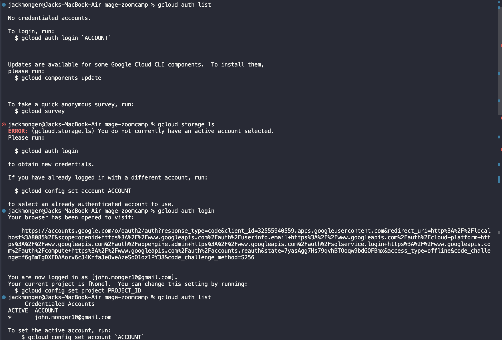
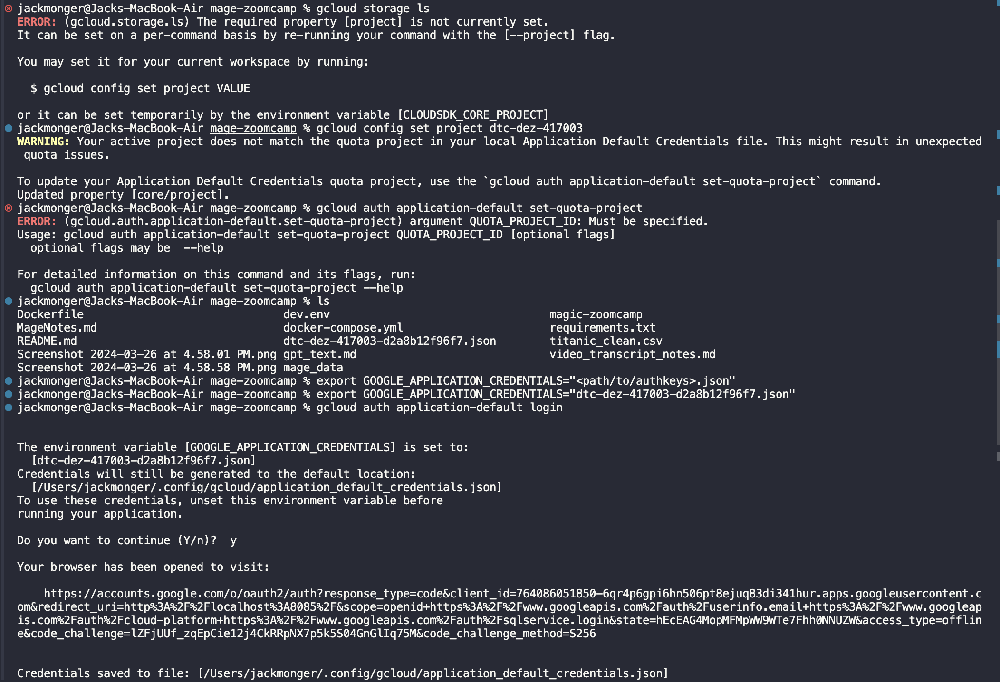

## 2.2.4 ETL: API to GCS
### Methodology
Data will be written to cloud bc storage is much cheaper and can accept semi-structured data much better than traditional RDB

From there, workflows involve staging, cleaning, and writing to analytical source. Or using data lake solution in cloud

#

### Coding Tips
Can drag and drop old data loaders/transformers. Be sure to link them together in tree view

### Data Engineering Principles
For large datasets, should we write to a single parquet file?

No!

We will partition by date so we can create even distribution for taxi rides


Now we have a folder instead of one large file


Each folder has a parquet file within it with the corresponding dates

### Why should we use this?

Partitioned files are much easier to work with because we only need to read one folder for one date instead of a whole file with many dates

More effiient from querying standpoint

Pyarrow abstracts away chunking logic with pandas

Would normally have to iterate through dataframe and use IO operations


## 2.2.5 ETL: GCS to BigQuery

### My Notes:

You can use pyarrow to pull the partitioned table together

We will use non-partitioned file

#### Best Practices:
Standardize Column Names


#### Export by SQL vs Python
1. SQL Exports add in a staging table to BigQuery 
2. Python only adds in the final table


## 2.2.6 Parameterized Execution
1. Blocks in mage are shared across resources
    - Editing the blocks will edit them across each pipeline they're in
    - Keep that in mind, need to copy text and make new block instead

2. For kwargs, can pass in variable from API 
3. Can also add in runtime variables from Triggers > Schedule > Runtime variables


Can parameterize on result received

Can parameterize on execution date

Store params elsewhere and pull them in that way

Many ways!
#

## 2.2.6. Backfills
If some data was lost or there's missing data and we need to rerun for many days/weeks/months

Would typically need to build a script for individual days or bulk calls... Can be frustrating!!!

Mage has a solution :)

Backfill functionality out of box to replicate lost data

# 2.2.7 - Deploying Mage on Google Cloud with Terraform
## Prereqs:
1. Terraform
    - Infrastructure management solution
    - Allows you to create  resources
    - Infrastructure as code
2. gcloud cli
    - Programmatic way of interfacing with google cloud
3. Google Cloud Permissions
4. Mage Terraform templates


## What we will do:
1. Create app using google cloud
2. Create backend db in google
3. Create persistent storage on google cloud

## If provisioned seapartelyd:
1. Take a long time
2. Wouldnt be version controlled

# 2.2.7 Deploying to Cloud Part 1

## Configuring GCLOUD permissions





use google_application_credentials path

```export GOOGLE_APPLICATION_CREDENTIALS="<path/to/authkeys>.json"```

then

```gcloud auth application-default login```