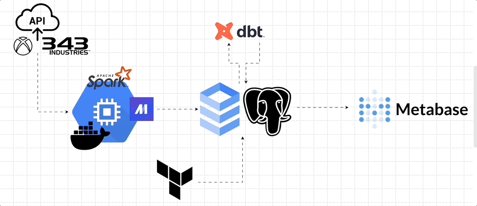

# Halo Data Pipelines Project


## Project Overview
This purpose of this project is to capture my Halo Infinite player data and export it to a PostgreSQL database. From there, I will use SQL to gain actionable insights related to:

1. Player Performance Metrics
2. Impact of Teammates
3. Optimal Team Combinations
4. Playlist Preferences
5. Identifying Other Trends and Patterns
6. Performance Improvement Strategies


## System Diagram



## Project Structure
```bash
Halo_Data_Pipelines/
│
├── halo-pipeline-project/
│   ├── .gitignore
│   ├── charts/
│   ├── custom/
│   ├── data_exporters/
│   │   ├── export_player_data_to_postgres.py
│   │   └── export_titanic_clean.py
│   ├── data_loaders/
│   │   ├── load_friends_data_dev.py
│   │   ├── load_friends_title_data_w_loader_dev.py
│   │   ├── load_my_data_dev.py
│   │   ├── load_my_title_data_w_loader_dev.py
│   │   └── load_titanic.py
│   ├── dbt/
│   │   └── profiles.yml
│   ├── extensions/
│   ├── interactions/
│   ├── io_config.yaml
│   ├── pipelines/
│   │   ├── example_pipeline/
│   │   ├── load_friends_info/
│   │   ├── load_my_info/
│   │   └── load_player_data_test/
│   ├── requirements.txt
│   ├── transformers/
│   │   ├── clean_data_test.py
│   │   ├── combine_friends_and_friends_title_data_dev.py
│   │   ├── combine_my_data_and_title_data_dev.py
│   │   ├── fill_in_missing_values.py
│   │   ├── load_friends_title_data_dev.py
│   │   ├── transform_friends_data_dev.py
│   │   ├── transform_friends_title_data_dev.py
│   │   ├── transform_my_data_dev.py
│   │   └── transform_my_title_data_dev.py
│   └── utils/
├── node_js_scripts/
│   ├── halo_auth.js
│   └── xbox_live_auth.js
├── .gitignore
├── Dockerfile
├── README.md
├── docker-compose.yml
├── halo_system_diagram.gif
└── requirements.txt
```


## Technologies Used

### Currently Using:

* **Cloud**: Google Cloud Platform
* **Languages**: Python, SQL, Node.js
* **Containerization**: Docker
* **Infrastructure as code (IaC)**: Terraform
* **Data Warehouse**: PostgreSQL in Google Cloud SQL
* **Batch processing**: Apache Spark
* **Workflow orchestration**: Mage
* **Data Visualization and Analytics**: Metabase

### Under Consideration:

* **Stream processing**: Kafka, Pulsar, Kinesis, ...


## Problem Statement

### <u>Background:</u>
Halo players can rely on platforms like Halo Waypoint for tracking their in-game performance metrics and achievements. However, Halo Waypoint has several limitations, such as:

1. **Lack of Granular Metrics**: The platform offers limited granularity in tracking player performance.

2. **No Real-Time Updates**: Halo Waypoint may experience delays in updating player data, resulting in outdated performance metrics and achievements.

3. **Lack of Customization**: Players have limited control over the types of metrics tracked and the level of customization available in performance tracking platforms.

4. **Limited Integration with Third-Party Tools**: Integrating Halo data with third-party analytics tools or visualization libraries may be challenging due to limitations in data accessibility and format.

### <u>Proposed Solution:</u>


To overcome these challenges, I will build custom data pipelines to extract, transform, and load Halo data into a PostgreSQL database. This solution will enable capture of more granular metrics, real-time updates, and facilitate integration with third-party tools for advanced analytics and visualization.

### <u>Expected Outcomes:</u>
1. Enhanced Performance Tracking: I will have access to more detailed and up-to-date performance metrics, allowing me to track my progress more effectively.
   
2. Improved Gaming Experience: By customizing performance tracking options and integrating with third-party tools, I can personalize my gaming experience and gain deeper insights into my gameplay.

3. Opportunities for Expansion:
Depending on the success of this project, I may be able to expand the scope in the future. This could include a tool for friends to use so they can track their in-depth performance or similar pipelines for other games.


## Inspired By:

<div style="text-align: center;">

[](https://www.youtube.com/watch?v=dbgK6cx--IY)

</div>
