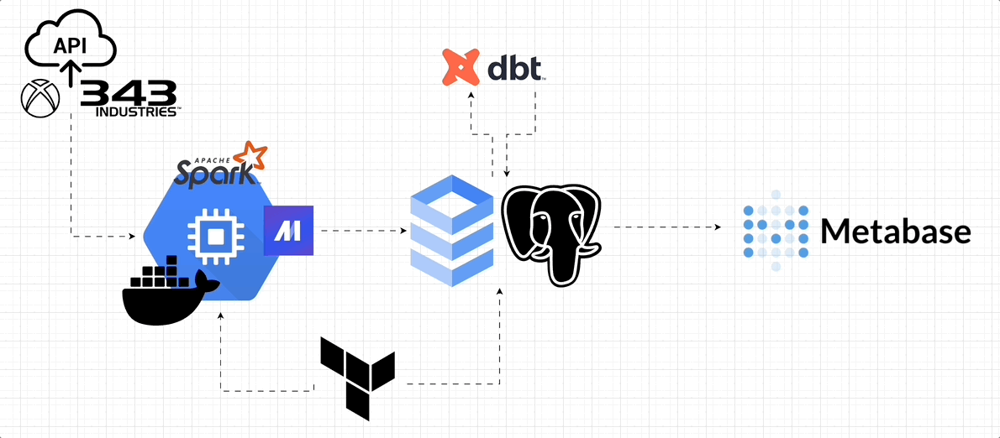

# Halo Data Pipelines Project


## Project Overview:
This purpose of this project is to capture my Halo Infinite player data and export it to a PostgreSQL database. From there, I will use SQL to gain actionable insights related to:

1. Player Performance Metrics
2. Impact of Teammates
3. Optimal Team Combinations
4. Playlist Preferences
5. Identifying Other Trends and Patterns
6. Performance Improvement Strategies


## System Diagram:



## Project Structure:
```bash
halo_project
├── halo_infinity
│   ├── custom
│   │   ├── dev_clear_duckdb_tables.py
│   │   ├── dev_loop_pipeline.py
│   │   ├── dev_query_duckdb.py
│   ├── data_exporters
│   │   ├── dev_add_foreign_key.py
│   │   ├── dev_export_cleaned_matches.py
│   │   ├── dev_export_game_variants.py
│   │   ├── dev_export_gamertags.py
│   │   ├── dev_export_logs.py
│   │   ├── dev_export_map_mode_pairs.py
│   │   ├── dev_export_maps.py
│   │   ├── dev_export_match_details.py
│   │   ├── dev_export_matches.py
│   │   ├── dev_export_playlists.py
│   │   └── export_titanic_clean.py
│   ├── data_loaders
│   │   ├── check_table_key_constraint.sql
│   │   ├── dev_get_auth.py
│   │   ├── dev_get_endpoints.py
│   │   ├── dev_get_gamertags.py
│   │   ├── dev_get_map.py
│   │   ├── dev_get_map_mode_pairs.py
│   │   ├── dev_get_maps.py
│   │   ├── dev_get_match_details.py
│   │   ├── dev_get_matches.py
│   │   ├── dev_get_most_recent_date.sql
│   │   ├── dev_get_most_recent_date_v2.sql
│   │   ├── dev_get_player_ids.sql
│   │   ├── dev_get_playlist.py
│   │   ├── dev_get_playlist_mapmodepair.py
│   │   ├── dev_get_playlists.py
│   │   ├── dev_get_ugcgamevariants.py
│   │   ├── dev_load_matches_from_postgres.sql
│   │   ├── dev_load_matches_from_postgres_v2.sql
│   │   ├── dev_query_matches.sql
│   │   ├── load_titanic.py
│   │   ├── query_game_variants.sql
│   │   ├── query_map_mode_pairs.sql
│   │   ├── query_maps.sql
│   │   └── query_playlists.sql
│   ├── io_config.yaml
│   ├── metadata.yaml
│   ├── pipelines
│   │   ├── dev_clean_matches
│   │   ├── dev_get_game_variant
│   │   ├── dev_get_gamertags
│   │   ├── dev_get_map_mode_pair
│   │   ├── dev_get_maps
│   │   ├── dev_get_match_details
│   │   ├── dev_get_matches
│   │   ├── dev_get_playlists
│   │   ├── dev_test_endpoints
│   │   └── example_pipeline
│   ├── requirements.txt
│   ├── transformers
│   │   ├── dev_check_gamertags.py
│   │   ├── dev_clean_matches_col_names.py
│   │   ├── dev_transform_match_details.py
│   │   ├── dev_transform_matches.py
│   │   └── fill_in_missing_values.py
├── node_js_scripts
│   ├── halo_auth.js
│   ├── package-lock.json
│   ├── package.json
│   └── xbox_live_auth.js
├── .gitignore
├── docker-compose.yml
├── Dockerfile
├── halo_system_diagram.gif
├── README.md
├── requirements.txt
```


## Technologies Used:

### Currently Using

* **Cloud**: Google Cloud Platform
* **Languages**: Python, SQL, Node.js
* **Containerization**: Docker
* **Infrastructure as code (IaC)**: Terraform
* **Data Warehouse**: PostgreSQL in Google Cloud SQL
* **Batch processing**: Apache Spark
* **Workflow orchestration**: Mage
* **Data Visualization and Analytics**: Metabase

### Under Consideration

* **Stream processing**: Kafka, Pulsar, Kinesis, ...


## Problem Statement:

### <u>Background</u>
Halo players can rely on platforms like Halo Waypoint for tracking their in-game performance metrics and achievements. However, Halo Waypoint has several limitations, such as:

1. **Lack of Granular Metrics**: The platform offers limited granularity in tracking player performance.

2. **No Real-Time Updates**: Halo Waypoint may experience delays in updating player data, resulting in outdated performance metrics and achievements.

3. **Lack of Customization**: Players have limited control over the types of metrics tracked and the level of customization available in performance tracking platforms.

4. **Limited Integration with Third-Party Tools**: Integrating Halo data with third-party analytics tools or visualization libraries may be challenging due to limitations in data accessibility and format.

### <u>Proposed Solution</u>


To overcome these challenges, I will build custom data pipelines to extract, transform, and load Halo data into a PostgreSQL database. This solution will enable capture of more granular metrics, real-time updates, and facilitate integration with third-party tools for advanced analytics and visualization.

### <u>Expected Outcomes</u>
1. Enhanced Performance Tracking: I will have access to more detailed and up-to-date performance metrics, allowing me to track my progress more effectively.
   
2. Improved Gaming Experience: By customizing performance tracking options and integrating with third-party tools, I can personalize my gaming experience and gain deeper insights into my gameplay.

3. Opportunities for Expansion:
Depending on the success of this project, I may be able to expand the scope in the future. This could include a tool for friends to use so they can track their in-depth performance or similar pipelines for other games.


## Inspired By:

<div style="text-align: center;">

[](https://www.youtube.com/watch?v=dbgK6cx--IY)

</div>
